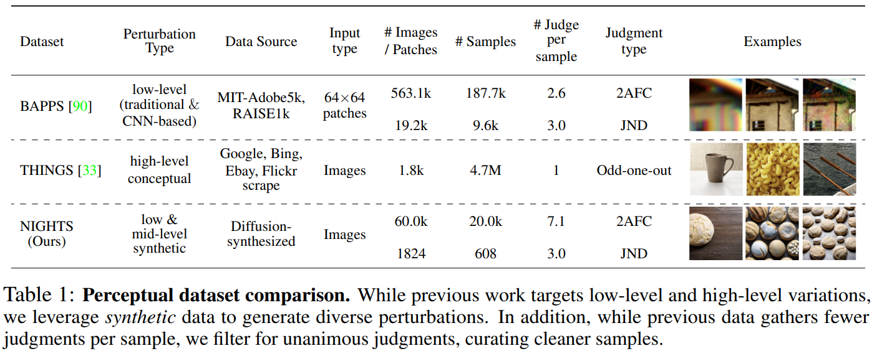
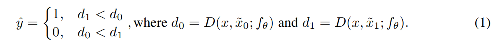
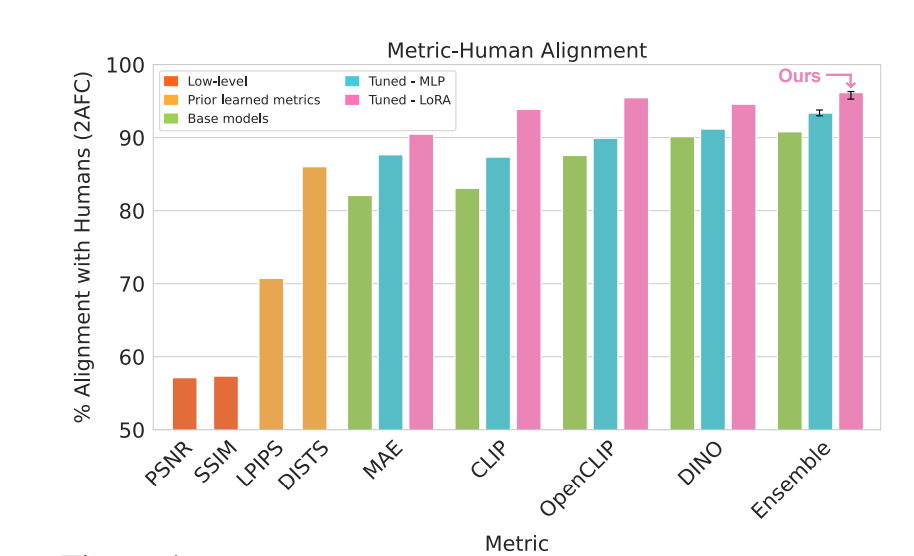
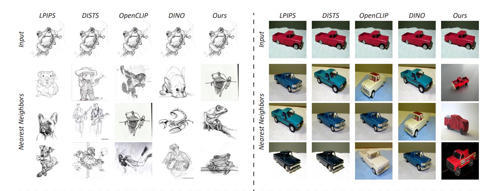
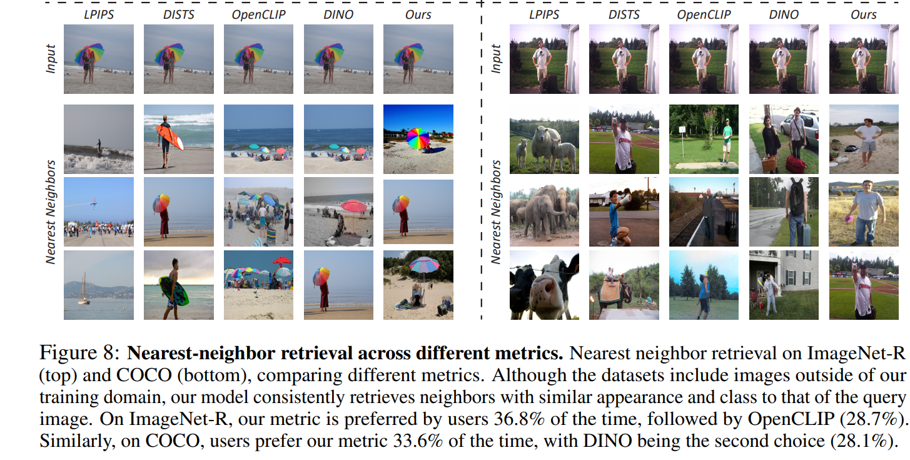

For Image similarity.

Traditional/regular/classical  image similarity refers to the alikeness (or) visual stimuli between 2 images. It uses low-level features such as color, texture, and shape (or) High-level semantic features (wheel, bumper, doors).  Low-level image similarity metrics L1, L2, MSE, PSNR, SSIM, as well as learned perceptual metrics such as LPIPS, and DISTS(with CNN Backbones). These metrics focus on the Pixel/Patch level only & not high-level features.

In general, the perceptual similarity between 2 images with subjective perception. It involves evaluating the similarity of objects based on how they are perceived by humans, taking into account various sensory modalities such as vision, audition, touch, taste, and smell. Recently High-level features captured with Large vision models like CLIP and DINO(with Transformers as backbones) using image embeddings/ features. However, they still do not align with the human perception of alikeness between 2 images.

Authors introduced a new perceptual metric, that bridges the gap between low-level and high-level. New Dataset NIGHTs is released. their triplets consist of a Reference image and 2 perturbed versions along with human judgments as to which version is closer to the reference image.

Our metric, DreamSim, can be dropped into existing pipelines(CLIP, DINO) and demonstrates high agreement with human visual perception in both quantitative assessments and qualitative comparisons using out-of-domain real images (e.g., image retrieval, image synthesis). compared to previous perceptual metrics, it focuses relatively heavily on foreground objects, while compared to modern image embeddings, it does not neglect color and layout.

Following standard practice, distance D(x, x˜; fθ) = 1 − cos( fθ(x),  fθ(˜x) ) is taken as the cosine distance between the CLS tokens taken from the last layer for DINO and MAE (before and after the layer normalization, respectively), and the embedding vector for CLIP and OpenCLIP.

Given a triplet (x, x˜0, x˜1), and a feature extractor fθ, the vote is calculated as:

Before these ensembles of models which take both low, medium, and high-level features, it is dino as the SOTA model to match human perception with image embeddings and cosine distance. authors concatenated features+LORA from the best-performing models on our dataset (DINO, CLIP, and OpenCLIP) into one ensemble metric.

Reference:
- https://arxiv.org/pdf/2306.09344.pdf
- https://dreamsim-nights.github.io/
- Image background removal tool: https://github.com/OPHoperHPO/image-background-remove-tool/
