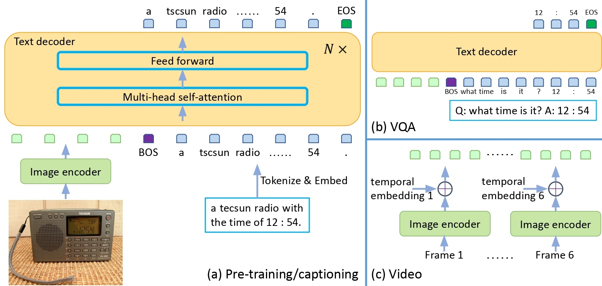
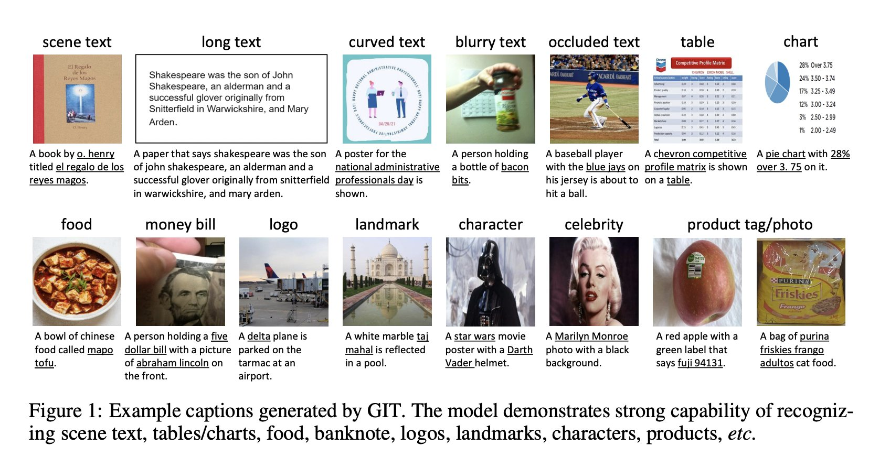

    

Generative Image to Text transformer using a single Image Encoder and single text Decoder with no need for object detectors.

Existing works had complex structures like multiple encoders and decoders, also they depend on external object taggers/detectors and OCR.

GIT uses Single Image encoder and Single Text decoder & increased pre-training data and model size to boost performance. CIDER scores are reported for Captioning tasks. GIT can be used for Image captioning, Visual Q&A, Video captioning and Image-Text Retrieval. 

The pre-training task is to just map the input image to entire associated text description with the language modelling objective.

The Image Encoder is a SWIN like Vision Transformer pre-trained on massive image-text pairs(0.8Billion) based on the Contrastive task. This eliminated the Dependency on Object-detectors. For VQA, the input question is treated as a text prefix(check architecture), and the answer is generated in an auto-regressive way.

SOTA performance on video tasks as well without Video-Dedicated encoders.

### Architecture:
The image encoder is a contrastive pre-trained model. The input is raw image and output is compact 2D feature map, which is flattened into a list of features, with an extra layer and layer norm layer, the image features are projected in to D dimensions, which is input to text decoder.

CoCa model unifies the Contrastive Task and Generation Task as a single pre-training phase. We seperated the two tasks sequentially
- Contrastive task to pre-train the image encoder
- Generative tasks to pre-train both the Image encoder and Text decoder.

The Text begins with [BOS] token and is decoded in an auto-regressive way until the [EOS] token or reaching the maximum steps. The Seq2Seq attention mask is applied so that the text token depends on the preceeding tokens and all the image tokens, and image tokens can attend to each other since they come from encoders. 

Instead of well initializing the image encoder, randomly intialize the text decoder.  Flamingo employed a similar architecture for image encoder+text decoder, but the decoder is pre-trained and frozen to preserve the generalization capability of the large language model.

With large scle pre-trianing we find the self-attention based decoder achieves better performance overall, while in small-scale setting the cross-attention based approach wins.

Thank you

In recent years, text-driven generative models Stable Diffusion, Imagen, DALLE-2, MUSE have emerged as powerful tools for image synthesis.

### Reference:
- https://github.com/microsoft/GenerativeImage2Text

