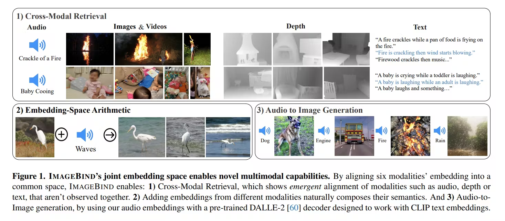

6 modalities embeddings into a common Embedding space. But all these 6 are binded with Image embeddings using image paired data for every single modality as a single shared representation space. hence the name ImageBind. Till now self supervised models like [CLIP](CLIP.md) has only a bi modal space for Text and Image embeddings.

below modalities were collected & binded with Images:
- image-text
- videos-images-text
- images-audio
- images-depth

Related work:
- [CLIP](CLIP.md) ,ALIGN, Florence used large collection of image-text data & trained models to embed images-texts to same joint embedding space.
- Cocoa added image captioning objective on contrastive loss for improved performance.
- Flamingo(from deepmind), handles both text & images in sequence(not in particular order, like in real world youtube video), making them good for Videos for summarization/understanding.
- Lit adopts Contrastive training for fine-tuning & observed freezing image encoders works the best.

Emergent alignment of unseen pairs of modalities:
Authors say 
		"ImageBind uses modalities paired with Images, i.e., pairs in the form of (Images,Modality) to align each the embeddings from each modality M to those from images. We observe an emergent behavior in the embedding space that aligns two pairs of modalities (M1,M2) even though we only train using the pairs (I,M1) and (I,M2). This behavior allows us to perform a wide variety of zero-shot and cross-modal retrieval tasks without training for them. We achieve state of-the-art zero-shot text-audio classification results without observing a single sample of paired (audio, text)."

Implementation Details of Models:
- used Transformers for all the modality encoders. VIT for images. they use the same encoder for images and videos like paper: : Single Model Masked Pretraining on Images and Videos. 

- Temporally inflated the patch projection layer of the VIT and use 2 frame video clips sampled from 2 seconds. Followed Interspeech for encoding audio and convert a 2 second audio sampled at 16kHz into spectrograms using 128 mel-spectrogram bins. As the spectrogram is also a 2D signal like an image, we use a ViT with a patch size of 16 and stride 10. We treat thermal images and depth images as one-channel images and used VIT to encode them.

Also followed Text encoder design from CLIP, AudioCLIP for Audio, OpenCLIP for Image-Text encoder weights are used. Pretrained Private implementation of DALLE-2 & replaced their text embeddings with Audio.

This post gets updated.

Thank you

### Reference:
https://arxiv.org/pdf/2305.05665.pdf

