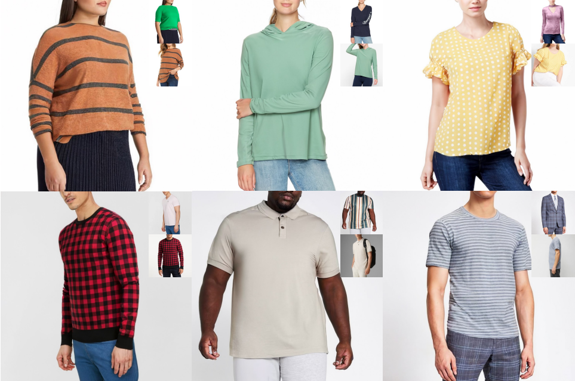
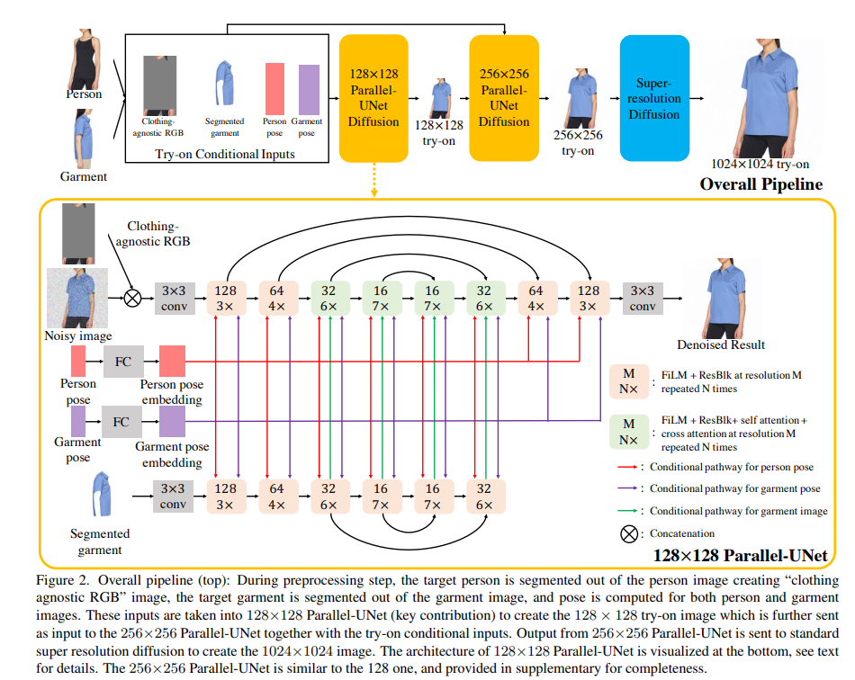

    

A tale of 2 U-Nets communicating through Cross-attention.

### input-output
Two images- person & Garment of Choice  --> Image with Garment on person.

### Proposed:
A Diffusion based architecture that combines 2 U-Nets to unite as Single-Net to 
- preserve input garment details
- warps the input garment around the body pose & body change

Key Ideas of this Model:
- Garment is warped implicitly via a cross attention mechanism.
- Garment warp & person blend happen as part of a unified process as opposed to a sequence of two separate tasks.

### Existing works
Most existing try-on methods only perform well when body pose and shape variation is small. When pose or body shape vary significantly, garments need to warp in a way that wrinkles are created or flattened according to the new shape or occlusions. 

Earlier works have been approached the warping problem via first estimating pixel displacements, e.g., optical flow, followed by pixel warping, and postprocessing with perceptual loss when blending with the target person. Fundamentally, however, the sequence of finding displacements, warping, and blending often creates artifacts, since occluded parts and shape deformations are challenging to model accurately with pixel displacements. It is also challenging to remove those artifacts later in the blending stage even if it is done with a powerful generative model. 

As an alternative, TryOnGAN showed how to warp without estimating displacements, via a conditional StyleGAN2 network and optimizing in generated latent space. While the generated results were of impressive quality, outputs often lose details especially for highly patterned garments due to the low representation power of the latent space. 

### Current Model:
can can handle large occlusions, pose changes, and body shape changes, while preserving garment details at 1024×1024 resolution. Trained on 4 Million images. 

using the same network to perform warping and blending allows the two processes to exchange information at the feature level rather than at the color pixel level which proves to be essential in perceptual loss and style loss. 

Specifically, Parallel-UNet based diffusion is used for 128×128 and 256×256 resolutions. The 256×256 result is then fed to a super-resolution diffusion network to create the final 1024×1024 image.

### Why not GANs:
Unlike GANs, Diffusion models have better training stability and mode coverage. They are proved SOTA models for super-resolution, colorization, novel-view synthesis and text-to-image generation.

### Diffusion models:
Although being successful, SOTA Diffusion models utilize a traditional UNet architecture with channel-wise concatenation for image conditioning. The channel-wise concatenation works well for image-to-image translation problems where Input & Output pixels are perfectly aligned (e.g., super-resolution, inpainting and colorization).

They consist of a Markovian forward process that gradually corrupts the data sample x into the Gaussian noise zT , and a learnable reverse process that converts zT back to x iteratively. Diffusion models can be conditioned on various signals such as class labels, texts or images.

### Method:
Train: Person Image (Ip) & Garment Image(Ig) of same person in same garment in different poses.
Inference: Ip and Ig of different persons in different garment in different poses.

Cascaded Diffusion model = 1 Base diffusion + 2 Super resolution diffusion models.

Base diffusion model is 128x128 parallel U-Net. 128x128 try-on result is direct downsample from ground truth in training. Clothing agnostic RGB Image (Ia) & Segmented Garment Image (Ic) can be noisy due to inaccurate human parsing & pose estimations. we added random gaussian noise to them. 

First SR diffusion model is another parallel U-Net for 256x256 try-on result. It generates this 256x256 try-on result from 128x128 try-on result. Second SR diffusion model is Effiecient-UNet. 

The person-UNet takes the clothing-agnostic RGB Ia and the noisy image zt as input. Since Ia and zt are pixelwise aligned, we directly concatenate them along the channel dimension at the beginning of UNet processing. 

The garment-UNet takes the segmented garment image Ic as input. The garment features are fused to the target image via cross attentions defined above. To save model parameters, we early stop the garment-UNet after the 32×32 upsampling block, where the final cross attention module in person-UNet is done.

### Reference:
- https://arxiv.org/pdf/2306.08276.pdf
- https://tryondiffusion.github.io/

