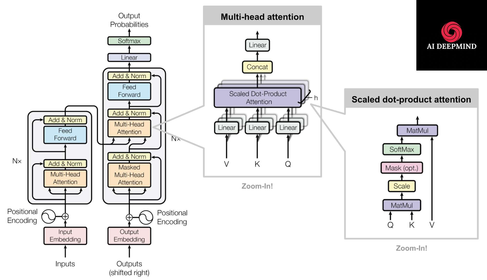
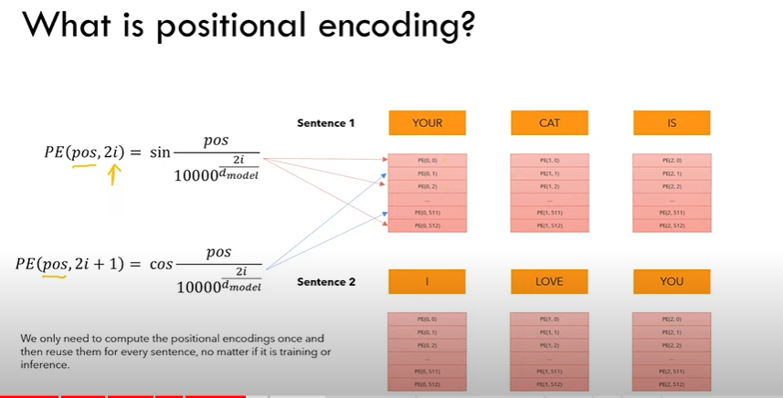
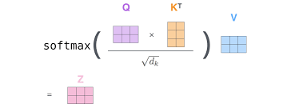
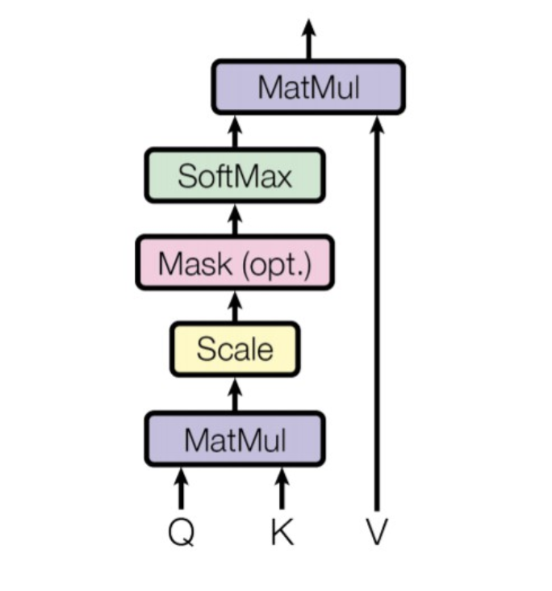
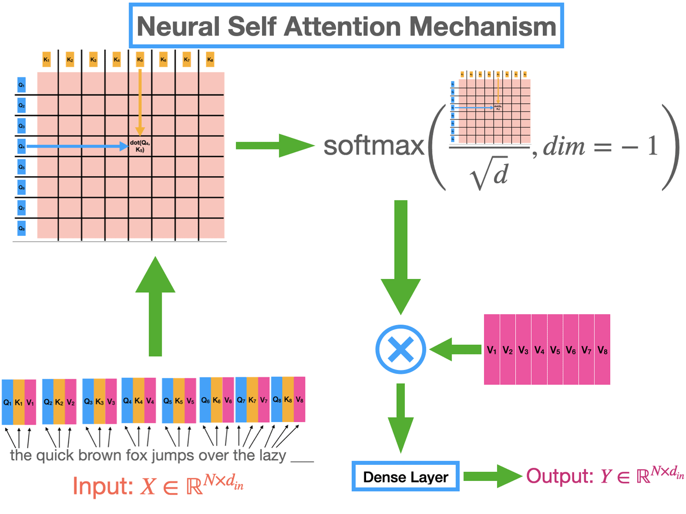
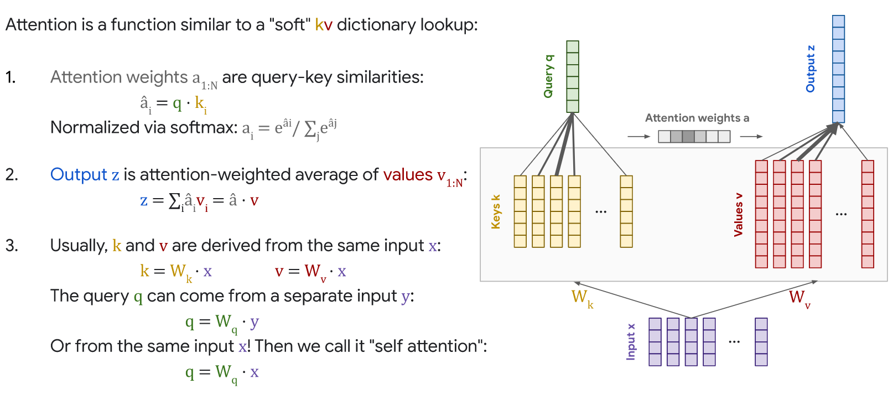
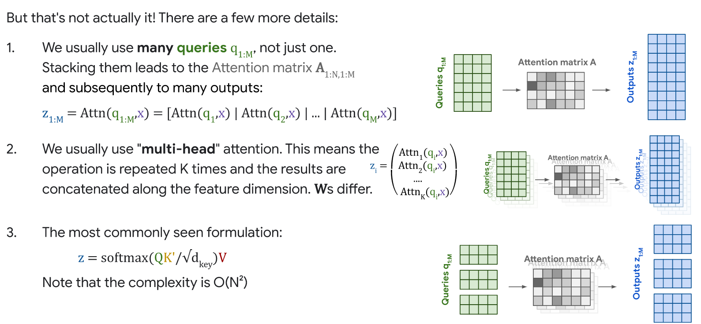
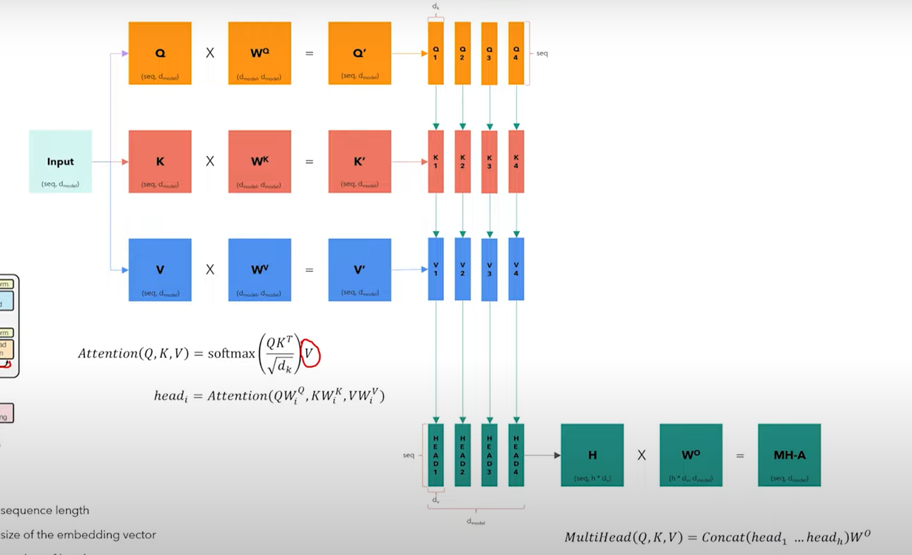
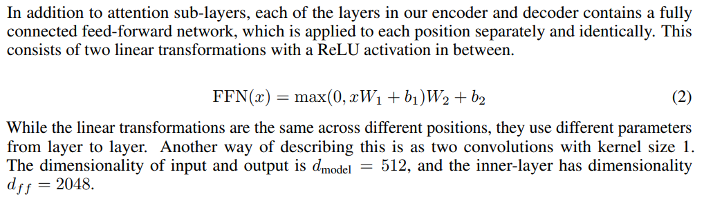
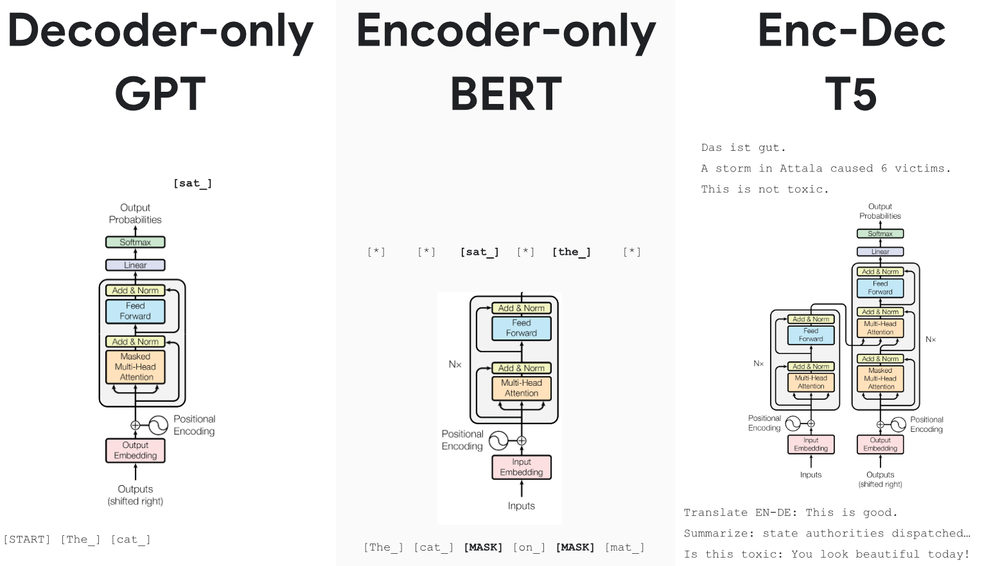

This is more of my understanding of Transformers rather than the paper summary.

The paper revolutionized Modern Deep learning in computer vision, Natural language processing, audio, speech, and more. These were first introduced for Language translation.

### Why not Traditional NLP:
RNNs, LSTMs, and GRUs are used before transformers & best fits for seq-seq prediction. Check this [post](https://purnasai.github.io/Recurrent-Neural-Networks-and-LSTM-explained/) for more about RNNs. 

RNNs are Slow. They use a time step at every token computation. Their gradients vanish with time or explode due to chain computations due to the long network which makes them retain only recent information. the gradients are not retained for longer text. They are not parallelizable.

Usage of Truncated BTT(ex: using a window of the last 10 timestamps only) also makes the model too slow than before and stills fail to handle longer text. 

The usage of **keep | Delete | update gates** in LSTM makes sequence processing better than RNNs. But even LSTMs are also too slow than RNNs as they involve heavy computation inside gates.

### Modern NLP:

#### Step1: Input Embeddings
input Text/sequence --> Each word is tokenized into sub tokens(like BERT using word piece tokenization, so we can match most text, even if it is not in learned text vocabulary.) --> Each sub token assigned a number(input ID) from the vocabulary --> each input ID is again given an embedding of 512 dimensions. 

#### Step2: Positional Encoding:
it represents a pattern. sin & cos trigonometric functions are used to add a piece of positional information to the input embeddings. this lets the model know the position of each word in the entire sentence.

#### step3: Attention(Scaled dot product attention)
Let's say the given input text is a query(Q) with dimensions 10x512, representing 10 words and each word with 512 dimension embeddings. it is multiplied with K^T, i.e Key Transpose of 512x10, gives 10x10 after multiplied. The Dot product is applied here. 

This dot product is divided by square root(512) or Scaled & multiplied with Value again, gives Attention mechanism.

 
 We compute the dot products of the query with all keys, divide each by √dk, and apply a softmax function to obtain the weights on the values. This dot product tells which word embedding is close to other word embeddings, the higher the score higher the agreement. 
 
 Dot-product attention is much faster and more space-efficient in practice since it can be implemented using highly optimized matrix multiplication code. 

we get weights from scores that we got from the dot product. we apply softmax and normalize them.

Why do we multiply with values?
because values are original word vectors and we multiply them with results from softmax, which are weights that were learned from softmax & dot product of q,k. So when we multiply W with V again, we are attaching weight information to V.  This step is what introduces context.

Attention is a function similar to a "Soft Lookup" in (Query, Key, Value) Dictionary.

More to it:

We suspect that for large values of dk, the dot products grow large in magnitude, pushing the softmax function into regions where it has extremely small gradients 4 . To counteract this effect, we scale the dot products by √dk .

#### Step4: Multi-head Attention
all the 3 (Q, k, V) are multiplied with respective Weights(W), which are trained/learnable parameters that give W prime. So for each word, we create a Query vector, a Key vector, and a Value vector. These vectors are created by multiplying the embedding by three weight(w) matrices that we trained during the training process.

The dimensionality of the weight matrix is 64, while the input dimension is 512. this is an architectural choice.  Now we split these 3 prime weights (Q, K, V) into parts by dimensions. so that all 4 heads see the part of embedding of each word, which means each head will see the full sentences, but different aspects of the same words w.r.t to other words.

#### Encoder:
stack of N=6 identical layers. 2 sublayers again. MHSA(Multiheadselfattention)+ FFN(Fully connected feedforward network). A skip connection for these 2 sublayers with Layer norm. The Encoder output is a heavily processed, high-level, contextualized version of the input text. this has nothing to do with the requested output yet & is only half part of the game.

#### Decoder: 
A stack of N = 6 identical layers. A third sub-layer performs multi-head attention over the output of the encoder stack. We modify the self-attention sub-layer to Masked self-attention that prevents positions from attending to subsequent(future) positions. 

This masking, combined with the fact that the output embeddings are offset by one position, ensures that the predictions for position i can depend only on the known outputs at positions less than i.

#### Position-wise feed-forward network:
The second sublayer in the Encoder and decoder blocks.

#### Applications of Attention in the model:
- Queries come from the previous decoder layer & Memory keys and values come from the output of the encoder. 
>This allows every position in the decoder to attend overall positions in the input sequence. This mimics the typical encoder-decoder attention mechanisms in sequence-to-sequence models

- A self-attention layer in the Encoder with all of the keys, values, and queries come from the same place, in this case, the output of the previous layer in the encoder. 
>Each position in the encoder can attend to all positions in the previous layer of the encoder.

- Self-attention layers in the decoder allow each position in the decoder to attend to all positions in the decoder **up to and including that position**. 
> We need to prevent leftward information flow in the decoder to preserve the auto-regressive property. We implement this inside of scaled dot-product attention by masking out (setting to −∞) all values in the input of the softmax which correspond to illegal connections.

All made these components powerful:
- complete Attention
- positional encodings with sin, cos trigonometry functions.
- residual/skip connections don't let model gradients vanish.
- interspersing of attention and MLP
- layers norms
- multiple heads attention<- parallelized, reduced computation, context calculation.

Various Versions of Transformers:

This will be continuously updated as I learn.

Most of the Images used in this post are from the different resources available.

#### Thank you

- A PPT presentation by Lucas Beyer [here](https://docs.google.com/presentation/d/1ZXFIhYczos679r70Yu8vV9uO6B1J0ztzeDxbnBxD1S0/mobilepresent?slide=id.g13dd67c5ab8_0_3897).
- https://www.youtube.com/watch?v=kCc8FmEb1nY&ab_channel=AndrejKarpathy
- https://www.youtube.com/watch?v=QCJQG4DuHT0&ab_channel=CodeEmporium
- https://www.youtube.com/watch?v=XfpMkf4rD6E&ab_channel=StanfordOnline
- https://www.youtube.com/watch?v=t5LjgczaS80&ab_channel=FormalLanguagesandNeuralNetworksSeminar
- The Encoder block is excellently explained here:https://www.youtube.com/watch?v=g2BRIuln4uc&ab_channel=Ark
