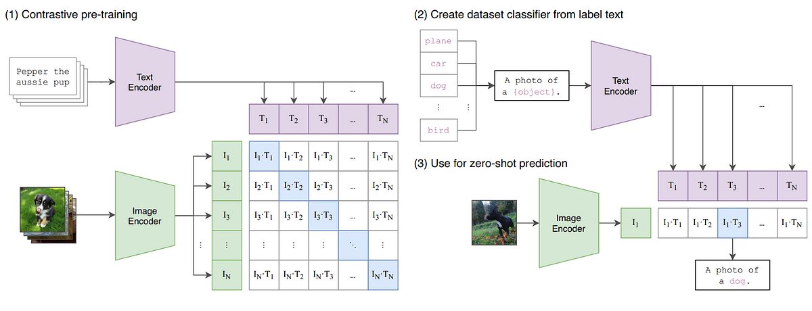

Learning Transferable visual Models from Natural Language supervision

A dataset of 400 Million Image-Text pairs are used as part of pretraining task of predicting which image caption goes with which image.

using text to refer/point images enabled Zero short Transfer. 

Learning directly from raw text using Task-agnostic objective such as 
- Auto Regressive
- Masked Language Modeling
have scaled up & improved model capabilities. These text-to-text standard Input-Output interface enabled zero-short Transfer to downstream tasks of any kind. GPT-2, GPT-3 demonstrates it.

#### Approach:
It is much easier to scale text supervision compared to standard crowd-sourced labeling for image classification like classic machine learning.

Learning from text also has an important advantage over unsupervised-self supervised approaches as this approach not just learn text/representation but also connects them that enabled zero shot learning.

Selecting efficient pretraining method:
- Shouldn't take more compute(Mahajan et al(2018) require 19 GPU years to train their ResNext101-32x-48d to predict only 1000 imagenet classes.).
- Shouldn't have a scalability problem(like Virtex).
Both the above approaches try to predict the exact words of the text accompanying image. this is difficult task due to the wide variety of descriptions, comments and related text.
- Shouldn't take extra order of compute(image generative models learn high quality image representations, but need an extra order of compute).

We started with BOW encoding baseline, later swapped the predictive objective(loss function) with contrastive objective. 

Clip is trained to predict which of the NxN possible(image-text) pairings occured for a given N(image/text). To do this authors made clip to learn Multi-Modal embedding space by jointly training an Image Encoder & Text Encoder to Maximize the Cosine similarity of Image & Text.

#### Image:
Clip is initialized from scratch. We do not use non-linear projection b/n representation and contrastive embedding space. they instead used Linear projection to map from each encoder's representation to the multi-model embedding space. A random square crop is the only data augmentation used.

A temperature parameter to control the range of logits in the softmax. A global average pooling layer is replaced with attention pooling mechanism.  it is a single "transformer style layer" multi head attention where Q is conditioned on the Global average pooled representation of the image.

#### Text:
The text encoder is a Transformer architecture. used 63M parameter 12 layer 512 wide model with 8 attention heads.  used lower case BPE(Byte Pair Encodings) represetnation of text with 49152 vocab size. Max length caped at 76 to reduce computation. [SOS] and [EOS] tokens at the start and end of the text is used. these feature representation is layer normalized & linearly projected into multi model embedding space.

Masked self attention was used in text-encoder to preserve the ability to intialize with pretraiend language model or add language modelling as auxiliary objective.

#### Training:
The learning temperature is set to 0.07
large minibatch size of 32,768 mixed precision was used to accelearte training.
Gradient checkpointing, Half precision adam were used.

#### Code:
An Implemetation of Clip for Image retrieval using Both Text and Image is [here](https://github.com/purnasai/CLIP_Image_Retrieval).

Thank you