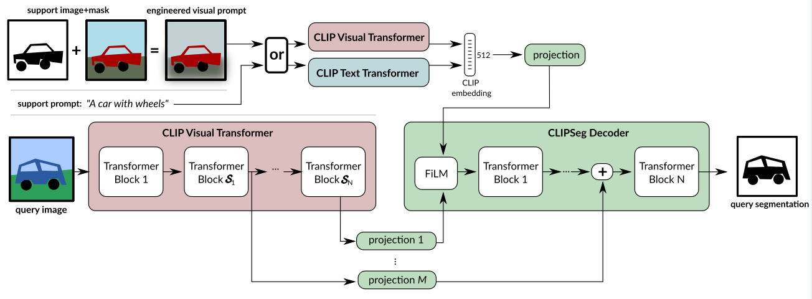

    

Image segmentation using Text and Image Prompts. 

General image segmentation is addressed by training a model for fixed set of objects. Incorporating additional classes requires re-training. Predicting each pixel is image segmentation.

we propose a prompt based image segmentation. it can be text/image. an unified model for 3 segmentation tasks:
- Referring expression segmentation
- Zero-shot segmentation
- One-shot segmentation
we used [CLIP](CLIP.md) as a backbone model. Not just what the object in image, but where it is.. is important in segmentation.

Different approaches:
- In generalized zero-shot segmentation, both seen and unseen categories are segmented by keeping unseen objects in relation to seen ones. eg: through word embeddings (or) wordnet.
- In one-shot segmentation, the required class mask is provided + query image to be segmented.
- In referring expression segmentation, a model is trained on complex text queries, but sees all classes during training.

Clipseg = Clip + A thin parameter efficient conditional segmentation layer on top. Clip models joint embedding space is helpful here. Authors idea is to teach decoder to relate activations inside clip with output segmentation.

Related works:
Bucher et al trained a DeeplabV3 network to synthesize artificial, pixel-wise features for unseen classes based on Word2Vec label embeddings.

- Clip Extensions: CLIP was combined with GAN to modify images based on text prompt and in robotics to generalize to unseen objects in manipulation tasks. In original CLIP papers, it is found that the Design of prompts matter for downstream tasks.

DECoder Architecture:
Simple transformer based decoder, which has U-Net inspired skip connections to the CLIP Encoder that allow decoder to be compact. so we have only 1,122,305 trainable parameters when D=64.

When an image is passed, activations at Certain layers S are read out & projected to the token embedding of our Decoder. these extracted activations are added to the internal activations of our decoder before each transformer block. Those Certain layers S=[3,7,9], consequently we also let our decoder have only 3 layers.

The Decoder  generates a binary segmentation by applying a linear projection on the tokens of its transformer(last layer) R (1+ (W/P × H/P ))×D → R^(W×H), where P is token patch size of CLIP. To inform the Decoder's input activation by a Conditional Vector using FiLM.

Conditional Vector can be obtained in 2 ways:
- CLIP text transformer embedding of a text query 
- CLIP visual transformer on a feature engineered prompt image.
Our model receives information about the segmentation target("what to segment?") through a conditional vector.

Authors enabled different image sizes by interpolating the positional embedding.

Clip based Masking:
The straight forward Equivalent to masked pooling in a visual transformer is to apply the mask on the tokens.

Image prompt engineering:
Exact form of how the Mask and Image are combined matters a lot.
- Decreasing the Background brightness.
- Blurring the background
- Cropping to the object

Others:
- Vocabulary size is not fixed.
- Different forms of IOU is used, keeping diversity of tasks like Foreground IOU, mean IOU, binary IOU.
- Average precision is used. Pytorch is used. 352x352 pixel images are used.

Limitations:
- our model is only focused on images, Video might suffer temporal consistency.
- More modalities such as sound & touch could be incorporated.

you can find Zero shot segmentation of CLIP_Seg at: https://huggingface.co/blog/clipseg-zero-shot

Thank you