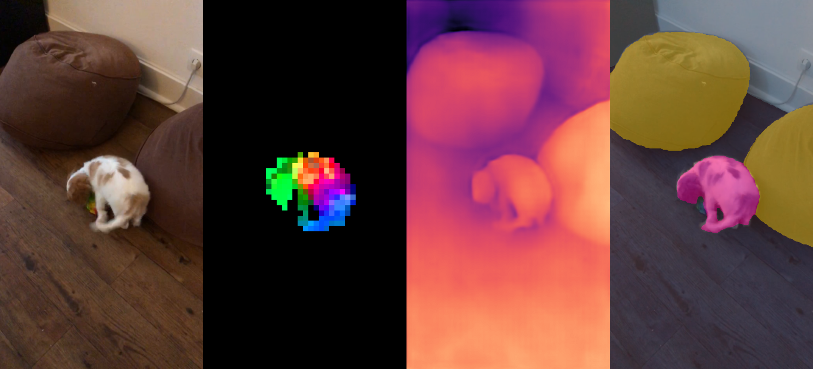
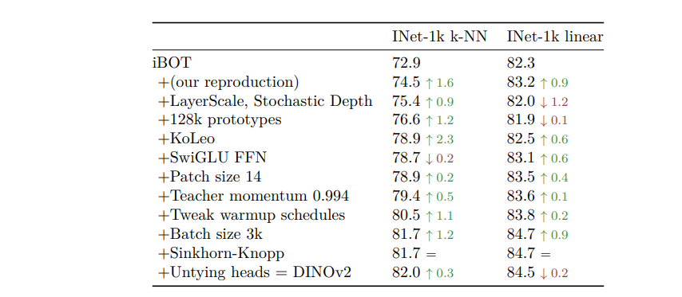
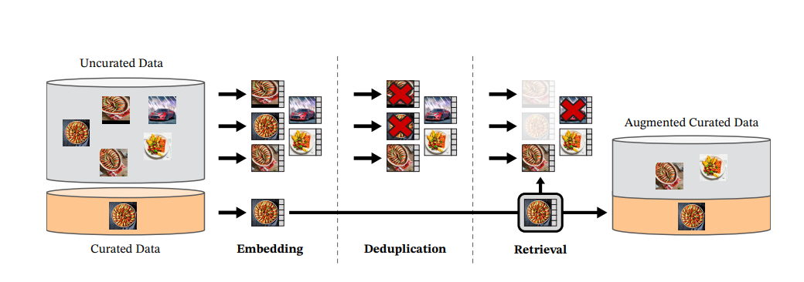

Paper [here](https://arxiv.org/abs/2304.07193)

- Dino is a Self-supervised Model, stands for **DI**stillation of knowledge with **NO** labels. knowledge distillation is splitting up large model into smaller models by minimizing distance b/n the outputs.
- They produce all purpose (or) task agnostic(irrelevant of task) features from images to use in any system with out finetuning, and some times performs better than finetuned models.
- A Curated Dataset(142M Images) with Automatic Data creation/processing pipeline + Distillation of VIT-1B model into smaller models made the magic.

Like BERT, GPT, T5, Flan-t5 and other LLMs(Large Language Models) in NLP, Researchers want this DINO & CLIP from OpenAI as Foundation models in Vision.

- Using Text-Guided pretraining, limits the information in images, since captions only approximate the rich features in images. complex pixel-level information may not surface with this approach.
- Further more the image encoders in them require **aligned text-image corpora** , and hence do not offer the flexibility.

Dino Researchers revisited **Descriminative self supervised approaches** that learn **both Image + Patch level information** such as iBOT.

In curating the dataset, Data Similarities were used instead of external meta data for automation.

#### Related work: 
Many other pre-text(before text, image at pretraining) tasks were in
- Recolorizing tasks
- predicting transformations
- inpainting
- patch-reordering

Revisiting Patch based architectures, like [[VIT]] to inpainting for pre-training. Particularly [[MAE are Scalable vision learners]] learns features that provide substantial improvements when finetuned on downstream tasks. This fine property of MAEs validated on Video, Audio and other cross modalities.

#### Data curation:
public data with "img" tags are extracted, discarded restricted domains, post process([[PCA Hash deduplication]] , NSFW filtering and blurring identifiable faces.) [[Self supervised Copy Detection]] is used to remove near-duplicate images. The Deduplication and retrieval stages rely on FAISS library. INFPQ(Inverted file pointer with quantization) with HNSW are used.

#### Pre-training:
learnt features that are combination of Dino and iBOT. added regularizer to spread features & a short high resolution training phase.
- Image level objective: cross entropy loss b/n features from student-teacher network. both features come from class-token of VIT, obtained from different crops of the same image. **we learn the parameters of the student & build the teacher with EMA(exp.. moving average)**. 
- patch-level objective: random masking some of input patches are given to student, but not to teacher. Added cross-entropy loss between the patch features of both networks on each masked patch. this loss is combined with image level loss.
- Sinkhorn-knopp centering, Koleo regularizer, adapting resolution to 518x518 during short period at end of pretraining.
- Flash attention is used to improve memory usage & speed on self-attention layers.
- same forward pass on the global and local crops lead to significant compute efficiency gains.
- Implementation of stochastic depth that skips the computation of the dropped residuals rather than masking the result.
- Some modifications, like LayerScale and a high Stochastic Depth (rate=0.4), incur a decrease in linear probe performance, but have the benefits of increasing the stability of training by avoiding NaN loss values during training.

#### [[FSDP]] :
adamW optimizer with 4 model replicas in fp32 for student, teacher, optimizer first moments, optimizer second moments.
		- weight shards will be in fp32 as required by optimizer, 
		- but broadcasting weights and reducing gradients is done in fp16. 

Finally As said, A good Model + Good data gave a good pre-trained model.

and 

#### CODE:
find the Dino_V2 implementation for Image classification, Image retrieval, image feature visualization using PCA in github [here](https://github.com/purnasai/Dino_V2).

Thank you!
